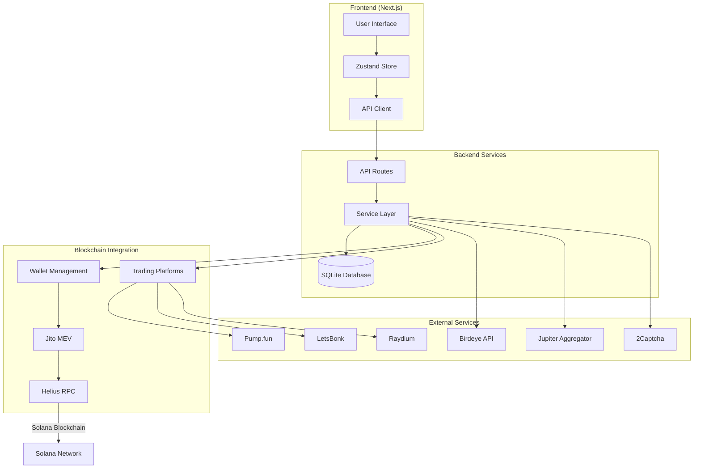
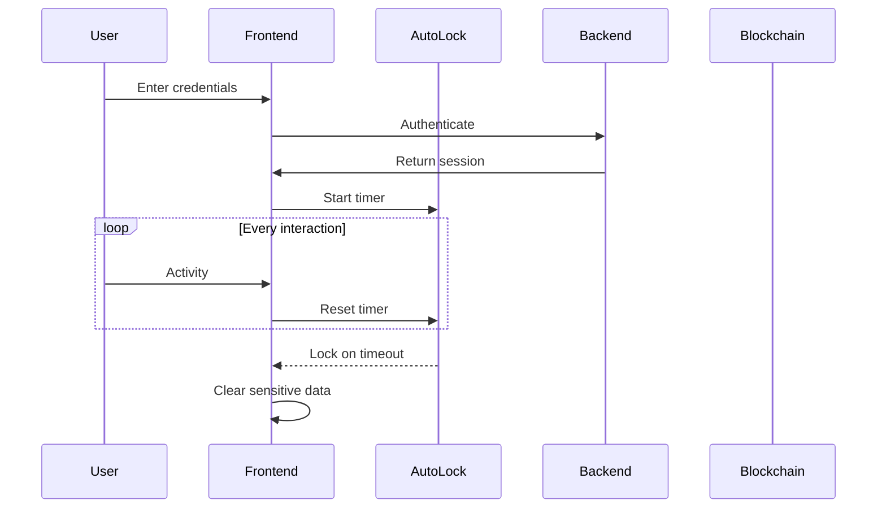
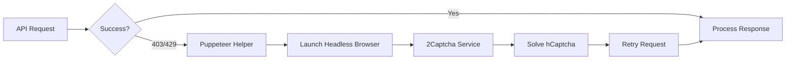

# The Keymaker - Architecture Documentation

## System Architecture Overview

The Keymaker is a production-ready Solana bundler for MEV and memecoin trading, built with Next.js, TypeScript, and Solana Web3.js.

## Data Flow Diagram



## Component Architecture

### Frontend Components
- **Dashboard**: Main control center with real-time monitoring
- **MarketCapCard**: Live market data visualization with ARIA accessibility
- **BundleEngine**: Core bundling and transaction execution
- **WalletManager**: Multi-wallet management with role-based organization
- **PnL Panel**: Profit/loss tracking with gas fees and Jito tips
- **ConnectionBanner**: Network status with RTT monitoring

### Backend Services
- **Bundle Service**: Transaction bundling and Jito MEV integration
- **Platform Service**: Token launch on multiple platforms
- **PnL Service**: Real-time profit/loss calculation
- **Puppeteer Helper**: Headless browser automation for captcha solving
- **Auto-lock Service**: Security with automatic session locking

### Database Schema
```sql
-- Core Tables
wallets (address, keypair, role, network, balance)
tokens (address, name, symbol, supply, decimals, platform)
trades (token_address, tx_ids, wallets, sol_in, sol_out, pnl, fees)
execution_logs (action, status, details, timestamp)
pnl_records (wallet, token, invested, returned, profit_loss)
bundles (executedAt, status, fees, outcomes)
settings (key, value)
errors (message, component, occurred_at)
```

## Security Architecture

### Encryption
- AES-256-GCM encryption for sensitive data
- Auto-lock timer (15 min default) clears keys from memory
- Secure key derivation with PBKDF2

### Authentication Flow


## Transaction Flow

### Bundle Execution
1. **Preparation**: Collect transactions from wallet groups
2. **Optimization**: Calculate optimal gas fees and Jito tips
3. **Bundle Creation**: Package transactions with MEV protection
4. **Submission**: Send to Jito block engine
5. **Monitoring**: Track bundle status and landing
6. **Settlement**: Update PnL and execution logs

### Captcha Fallback Flow


## Performance Optimizations

### Caching Strategy
- In-memory caching for frequently accessed data
- SQLite for persistent storage
- Redis-compatible caching for distributed deployments

### Rate Limiting
- RPC request queue management
- Adaptive retry with exponential backoff
- Circuit breaker pattern for failing services

## Deployment Architecture

### Docker Deployment
```yaml
services:
  app:
    image: ghcr.io/keymaker:latest
    environment:
      - NODE_ENV=production
      - PUPPETEER_EXECUTABLE_PATH=/usr/bin/chromium-browser
    volumes:
      - ./data:/app/data
    ports:
      - 3000:3000
```

### Tauri Desktop App
- Native performance with web technologies
- Auto-update mechanism via GitHub releases
- Code signing for Windows, macOS, and Linux

## Monitoring & Observability

### Health Checks
- Database connectivity
- RPC endpoint status
- Jito service availability
- Puppeteer functionality

### Metrics
- Transaction success rate
- Bundle landing rate
- PnL performance
- RTT monitoring (30-min history)

## Scalability Considerations

### Horizontal Scaling
- Stateless API design
- Shared database with connection pooling
- Load balancer compatible

### Vertical Scaling
- Efficient memory management
- Lazy loading of heavy components
- Optimized database queries

## Technology Stack

- **Frontend**: Next.js 14, React 18, TypeScript, Tailwind CSS
- **Backend**: Node.js 20, Express middleware
- **Database**: SQLite (development), PostgreSQL (production-ready)
- **Blockchain**: Solana Web3.js, Jito-ts, Raydium SDK
- **DevOps**: Docker, GitHub Actions, Tauri
- **Security**: AES-256-GCM, PBKDF2, 2Captcha